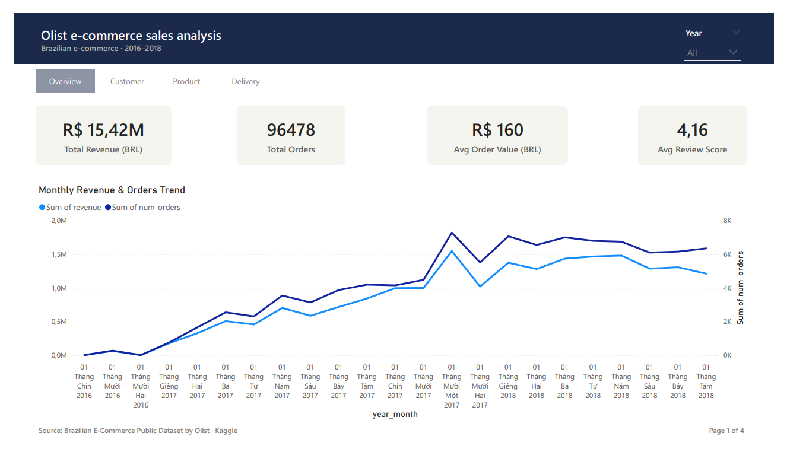
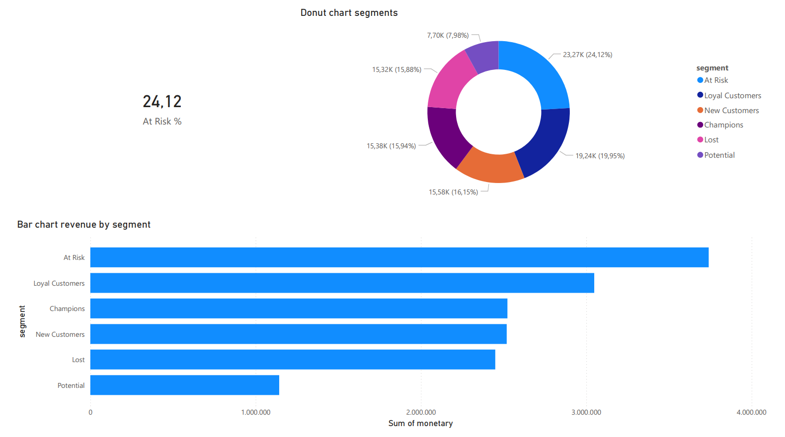
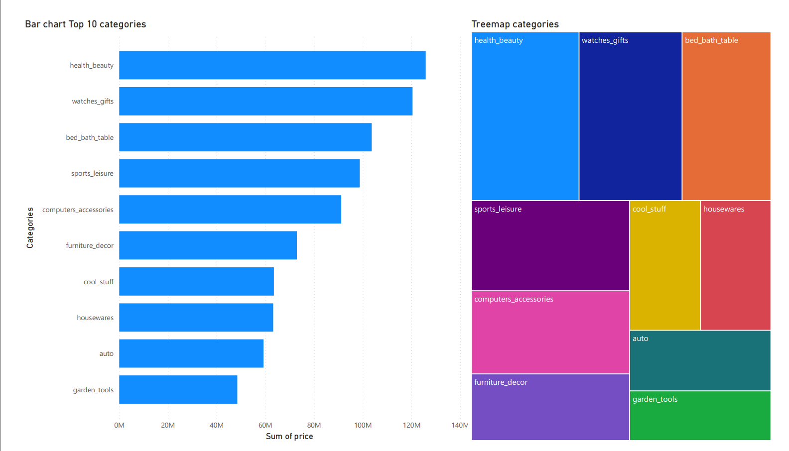
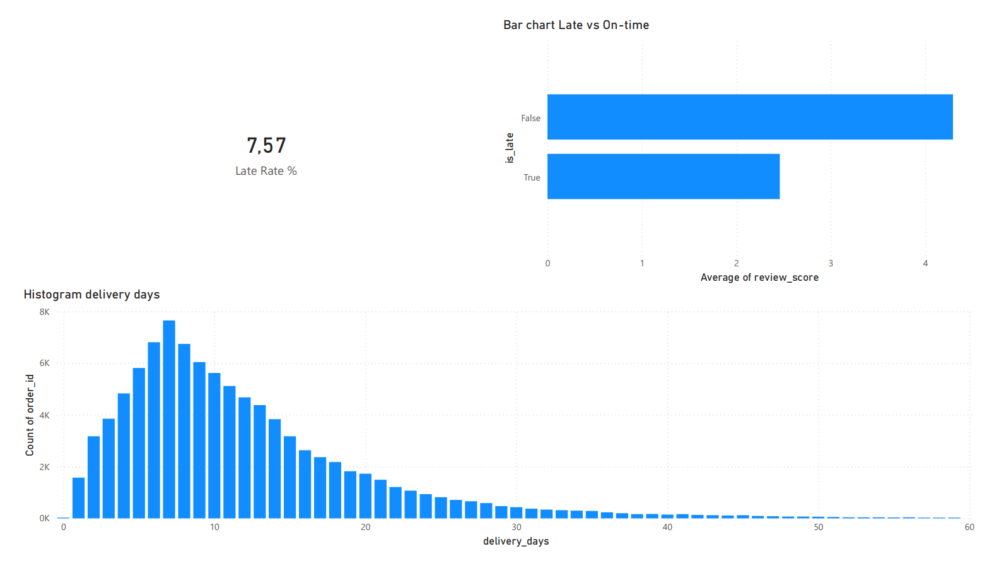

# 🛒 Olist E-Commerce Sales Analysis Dashboard

End-to-end data analysis project on Brazilian e-commerce platform Olist,
covering 100,000+ orders from 2016–2018.

## 📊 Dashboard Preview





## 🎯 Business Questions Answered
- How has revenue trended over time? Are there seasonal patterns?
- Which product categories drive the most revenue?
- Who are our most valuable customers? (RFM Segmentation)
- How does late delivery impact customer satisfaction?
- Can we predict whether a customer will leave a low review?

## 💡 Key Insights
- **7.6% late delivery rate** causes review score to drop from **4.29 → 2.46 out of 5**
  — a 1.83-point impact, the single biggest driver of low ratings
- **24.1% of customers are "At Risk"** of churning — the largest segment,
  suggesting an urgent need for a win-back campaign
- **100% of customers purchased only once** (frequency std = 0) —
  indicating a critical gap in retention and loyalty strategy
- Estimated delivery averages **23 days** vs actual **10 days** —
  Olist deliberately over-estimates to manage customer expectations
- High-value customers exist (max order: **13,664 BRL**) but remain
  underleveraged — upsell and VIP programs could unlock significant revenue
- **days_diff** (how early/late vs estimate) is the single most important
  predictor of review score (50% feature importance in Random Forest)

## 🧹 Data Cleaning
- Handled missing values across 7 tables (full details in notebook)
- `order_approved_at`: 160 nulls filled with purchase timestamp
- Product info: 610 nulls filled with `unknown` / median for deleted listings
- Review comments: 88.3% had no title, 58.7% had no message — filled with placeholder
- Resolved **551 duplicate reviews** by keeping most recent submission
- Remaining 4,748 nulls in delivery dates are valid (incomplete/cancelled orders)
- **Final clean dataset: 99,441 orders · 98,673 reviews · 0 unintended duplicates**

## 🛠️ Tech Stack
| Tool | Usage |
|------|-------|
| Python (Pandas, Seaborn, Matplotlib) | Data cleaning, EDA, RFM analysis |
| Scikit-learn | K-Means Clustering, Random Forest |
| Google Colab | Development environment |
| Power BI Desktop | Interactive 4-page dashboard |
| GitHub | Version control |

## 📁 Dataset
[Brazilian E-Commerce Public Dataset by Olist](https://www.kaggle.com/datasets/olistbr/brazilian-ecommerce)
— 9 tables, 100k+ orders, publicly available on Kaggle

## 📂 Project Structure
```
├── data/               # Processed CSV files for Power BI
├── notebooks/
│   ├── olist_analysis.ipynb    # EDA, RFM, Delivery analysis
│   └── modeling.ipynb          # K-Means Clustering, Random Forest
├── dashboard/          # Power BI .pbix file
└── image/             # Dashboard screenshots
```

## 🔍 Analysis Breakdown

### 1. Data Cleaning & Preprocessing
- Inspected 7 tables for missing values and duplicates
- Applied targeted imputation strategies per column type
- Converted all datetime columns and engineered time features

### 2. Exploratory Data Analysis
- Revenue trend by month (2016–2018)
- Top 10 product categories by revenue
- Order status & review score distribution

### 3. RFM Customer Segmentation
Segmented **96,478 customers** into 6 groups:

| Segment | Count | % |
|---------|-------|---|
| At Risk | 23,266 | 24.1% |
| Loyal Customers | 19,243 | 19.9% |
| New Customers | 15,578 | 16.1% |
| Champions | 15,378 | 15.9% |
| Lost | 15,316 | 15.9% |
| Potential | 7,697 | 8.0% |

### 4. Delivery Performance Analysis
- On-time rate: **92.4%** · Late rate: **7.6%**
- Median actual delivery: **10 days** vs estimated **23 days**
- Late delivery reduces review score by **1.83 points** on average

## 🤖 Machine Learning Models

### 1. K-Means Customer Segmentation (k=4)
K optimal selected via Elbow Method (inflection point at k=4→5 where inertia drop
decreases from ~15,000 to ~6,000):

| Cluster | Count | % | Avg Recency | Avg Monetary | Label |
|---------|-------|---|-------------|--------------|-------|
| 0 | 35,532 | 36.8% | 136 days | 136 BRL | Active Customers |
| 3 | 35,780 | 37.1% | 304 days | 131 BRL | Inactive |
| 1 | 22,573 | 23.4% | 507 days | 132 BRL | Lost |
| 2 | 2,593 | 2.7% | 290 days | 1,126 BRL | High Value |

K-Means independently discovered the **High Value** segment (2.7% of customers,
avg spend 8x higher than others) — consistent with RFM rule-based findings.

### 2. Random Forest — Review Score Prediction
Binary classification: predict High Review (4-5★) vs Low Review (1-3★)

| Metric | Baseline Model | Balanced Model |
|--------|---------------|----------------|
| Accuracy | 81.68% | 76.22% |
| F1 (High Review) | 0.894 | 0.851 |
| F1 (Low Review) | 0.330 | 0.410 |
| ROC-AUC | 0.663 | 0.662 |
| Recall (Low Review) | 0.21 | 0.38 |

**Feature Importance:**
- `days_diff` — 50% (how early/late vs estimated delivery)
- `is_late` — 28% (binary late flag)
- `delivery_days` — 20% (actual delivery duration)
- `estimated_days` — 3% (least important)

**Key finding:** `days_diff` alone accounts for 50% of predictive power —
confirming that managing delivery expectations is more impactful than
reducing absolute delivery time.